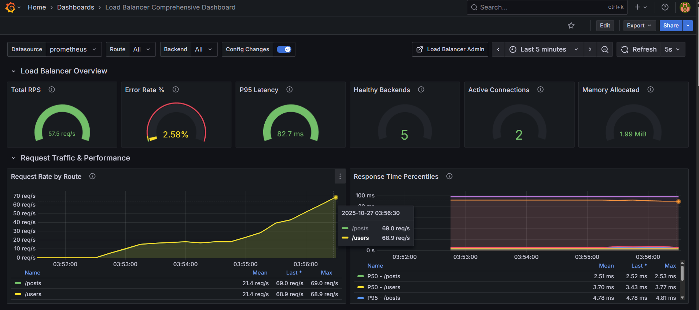
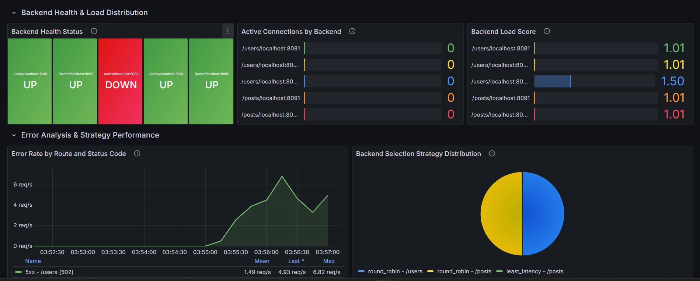
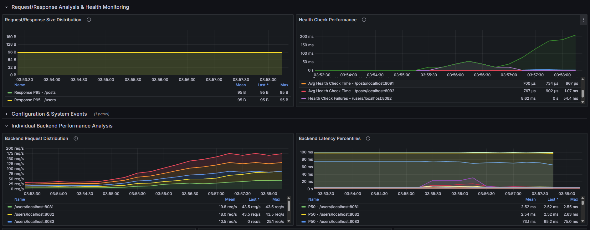
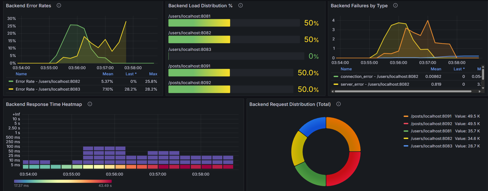

# Load Balancer

A high-performance, production-ready HTTP load balancer written in Go with comprehensive monitoring, health checking, and multiple load balancing strategies.

## Table of Contents

- [Features](#features)
- [Architecture](#architecture)
- [Performance](#performance)
- [Load Balancing Strategies](#load-balancing-strategies)
- [Installation](#installation)
- [Configuration](#configuration)
- [Monitoring & Metrics](#monitoring--metrics)
- [API Endpoints](#api-endpoints)
- [Development](#development)
- [Usage Examples](#usage-examples)
- [Contributing](#contributing)
- [License](#license)
- [Acknowledgments](#acknowledgments)
- [Support](#support)
- [Roadmap](#roadmap)

## Features

### Core Functionality
- Multiple load balancing strategies (Round Robin, Least Connections, Weighted Round Robin, Least Loaded, IP Hash)
- Active and passive health checking
- Automatic backend failure and recovery detection
- Request/response size tracking
- Rate limiting
- Graceful shutdown

### Monitoring & Observability
- Prometheus metrics integration
- Comprehensive Grafana dashboard
- Request tracing with unique request IDs
- Structured logging
- Real-time health status monitoring
- Performance metrics (latency, throughput, error rates)

### Management
- HTTP Admin API for runtime configuration
- Dynamic route management
- Backend addition/removal without restart
- Configuration hot-reload
- Health check endpoint

## Architecture

```
┌─────────────┐
│   Clients   │
└──────┬──────┘
       │
       v
┌─────────────────────────────────────┐
│      Load Balancer (Port 8080)      │
│  ┌───────────────────────────────┐  │
│  │   Route Matching & Strategy   │  │
│  └───────────┬───────────────────┘  │
│              │                      │
│  ┌───────────v───────────────────┐  │
│  │     Health Check Manager      │  │
│  └───────────┬───────────────────┘  │
│              │                      │
│  ┌───────────v───────────────────┐  │
│  │      Metrics Collection       │  │
│  └───────────────────────────────┘  │
└──────────────────┬──────────────────┘
                   │
        ┌──────────┼───────────┐
        │          │           │
        v          v           v
    ┌────────┐ ┌────────┐ ┌────────┐
    │Backend1│ │Backend2│ │Backend3│
    └────────┘ └────────┘ └────────┘
```

## Performance

Below are Grafana dashboard snapshots showing real-world performance and runtime metrics.(stress tested using Postman)

Load Balancer Overview:


Backend Health and Load Distribution:


Request/Response analysis and Health Monitoring:


Individual Backend performance analysis:


## Load Balancing Strategies

### 1. Round Robin
Distributes requests sequentially across all healthy backends.

```yaml
strategy: round_robin
```

**Use case**: Even distribution with similar backend capacity

### 2. Least Connections
Routes to the backend with the fewest active connections.

```yaml
strategy: least_connections
```

**Use case**: Long-running connections, WebSocket, streaming

### 3. Weighted Round Robin
Distributes based on assigned weights.

```json
 {
      "prefix": "/posts",
      "backends": [
        {
            "url":"http://localhost:8081"
            "weight": 3    
        },
        {
            "url":"http://localhost:8082"
            "weight": 1
        }
      ],
      "strategy": "weighted_round_robin"

}
```

**Use case**: Different backend capacities (CPU, memory)

### 4. Least Loaded
Routes to backend with lowest combined metric of active connections and latency.

```yaml
strategy: least_loaded
```

**Use case**: Mixed workloads, varying response times

### 5. IP Hash
Consistent routing based on client IP address.

```yaml
strategy: ip_hash
```

**Use case**: Session affinity, stateful applications


## Installation

### Prerequisites

- Go 1.21 or higher
- Prometheus (optional, for metrics)
- Grafana (optional, for visualization)

### Build from Source

```bash
# Clone the repository
git clone https://github.com/shashankk204/load_balancer.git
cd load_balancer

# Install dependencies
go mod download

# Build the binary
go build -o load_balancer ./cmd/main.go

# Run the load balancer
./load_balancer
```


## Configuration

### Configuration File (routes.json)

```json
{
  "routes": [
    {
      "prefix": "/users",
      "backends": [
        "http://localhost:8081",
        "http://localhost:8083"
      ]
    },
    {
      "prefix": "/posts",
      "backends": [
        "http://localhost:8091",
        "http://localhost:8092"
      ],
      "strategy": "least_latency"

    },
    {
      "prefix": "/post2s",
      "backends": [
        {
            "url":"http://localhost:8071"
            "weight": 3    
        },
        {
            "url":"http://localhost:8072"
            "weight": 1
        }
      ],
      "strategy": "weighted_round_robin"

    }
  ]
}

```

<!-- ### Environment Variables

```bash
# Server configuration
LB_PORT=8080
LB_ADMIN_PORT=9090

# Health check configuration
LB_HEALTH_CHECK_INTERVAL=10s
LB_HEALTH_CHECK_TIMEOUT=5s

# Logging
LB_LOG_LEVEL=info
LB_LOG_FORMAT=json

# Metrics
LB_METRICS_ENABLED=true
``` -->


## Monitoring & Metrics

### Prometheus Metrics

The load balancer exposes the following metrics at `http://localhost:9090/metrics`:

#### Route-Level Metrics

```
# Request metrics
lb_route_requests_total{route, method, status_code}
lb_route_request_duration_seconds{route, method}
lb_route_active_requests{route}
lb_route_errors_total{route, error_type}

# Size metrics
lb_route_request_size_bytes{route}
lb_route_response_size_bytes{route}

# Strategy metrics
lb_route_strategy_changes_total{route, from_strategy, to_strategy}
```

#### Backend-Level Metrics

```
# Health metrics
lb_backend_health_status{route, backend, backend_host}
lb_backend_health_check_duration_seconds{route, backend, backend_host}
lb_backend_health_check_failures_total{route, backend, backend_host}

# Request metrics
lb_backend_requests_total{route, backend, backend_host, status_code}
lb_backend_request_duration_seconds{route, backend, backend_host}
lb_backend_active_connections{route, backend, backend_host}

# Load metrics
lb_backend_load_score{route, backend, backend_host}
lb_backend_selection_total{route, backend, backend_host, strategy}
lb_backend_failures_total{route, backend, backend_host, failure_type}
```

#### System Metrics

```
# Go runtime metrics (automatically exposed)
go_memstats_alloc_bytes
go_memstats_heap_inuse_bytes
go_memstats_stack_inuse_bytes
go_goroutines
```

### Grafana Dashboard

Import the included Grafana dashboard for comprehensive visualization:

```bash
# Import the dashboard
curl -X POST http://localhost:3000/api/dashboards/db \
  -H "Content-Type: application/json" \
  -d @load-balancer-dashboard.json
```

Dashboard features:
- Real-time request rates and latency
- Backend health status
- Error rate tracking
- Load distribution visualization
- Memory usage monitoring
- Connection tracking

### Setting up Monitoring Stack

#### Prometheus Configuration

```yaml
# prometheus.yml
global:
  scrape_interval: 15s

scrape_configs:
  - job_name: 'load-balancer'
    static_configs:
      - targets: ['host.docker.internal:8080']
    scrape_interval: 5s
    metrics_path: /metrics
```

#### Running Prometheus+Grafana

```bash
docker-compose up -d
```


## API Endpoints

### Admin API (Port 8080)

The admin API is available at `http://localhost:8080/admin/`

#### List Routes

```bash
GET /admin/list
```

Response:
```json
{
  "/users": {
    "strategy": "round_robin",
    "backends": [
      {
        "url": "http://localhost:8081",
        "healthy": true,
        "active_connections": 5,
        "total_requests": 1234,
        "avg_latency_ms": 45.2
      }
    ]
  }
}
```

#### Add Backend to Route

```bash
POST /admin/add-backend
Content-Type: application/json

{
  "prefix": "/users",
  "url": "http://localhost:8084",
  "strategy": "round_robin"
}
```

Response:
```json
{
  "status": "success",
  "action": "add-backend",
  "prefix": "/users",
  "url": "http://localhost:8084",
  "strategy": "round_robin"
}
```

#### Remove Backend from Route

```bash
POST /admin/remove-backend
Content-Type: application/json

{
  "prefix": "/users",
  "url": "http://localhost:8084"
}
```

Response:
```json
{
  "status": "success",
  "action": "remove-backend",
  "prefix": "/users",
  "url": "http://localhost:8084"
}
```

#### Update Route

```bash
PUT /admin/update
Content-Type: application/json

{
  "prefix": "/users",
  "backends": [
    "http://localhost:8081",
    "http://localhost:8082",
    "http://localhost:8083"
  ],
  "strategy": "least_connections"
}
```

Response:
```json
{
  "status": "success",
  "action": "update-route",
  "prefix": "/users",
  "strategy": "least_connections"
}
```

## Development

### Project Structure

```
load_balancer/             
├── pkg/
│   ├── backend.go               # Backend server implementation
│   ├── loadbalancer.go          # Core load balancer logic
│   ├── metrics.go               # Prometheus metrics
│   ├── Trie.go                  # Trie Datastructure Implementation
│   └── logger/
│       └── logger.go 
├── controller/
│   └── admin.go                 # Admin API handlers
├── utils/
│   └── utils.go                 # Utility functions (JSON responses, etc.)
├── routes.json                  # Routes configuration file
├── prometheus.yml               # Prometheus config file
├── load-balancer-dashboard.json #Grafana Dashboard as code
├── go.mod
├── go.sum
├── docker-compose.yml           # To run Prometheus+Grafana
├── main.go                      # Application entry point
└── README.md
```

## Usage Examples

### Dynamic Configuration

```bash
# Add a backend to existing route
curl -X POST http://localhost:9090/admin/add-backend \
  -H "Content-Type: application/json" \
  -d '{
    "prefix": "/users",
    "url": "http://localhost:8084",
    "strategy": "round_robin"
  }'

# Remove a backend from route
curl -X POST http://localhost:9090/admin/remove-backend \
  -H "Content-Type: application/json" \
  -d '{
    "prefix": "/users",
    "url": "http://localhost:8084"
  }'

# Update entire route configuration
curl -X PUT http://localhost:9090/admin/update \
  -H "Content-Type: application/json" \
  -d '{
    "prefix": "/users",
    "backends": [
      "http://localhost:8081",
      "http://localhost:8082"
    ],
    "strategy": "least_loaded"
  }'

# List all routes and their backends
curl http://localhost:9090/admin/list | jq
```

### Testing the Load Balancer

```bash
# Send test requests
for i in {1..100}; do
  curl http://localhost:8080/users/test
done

# Check backend distribution
curl http://localhost:9090/admin/list | jq '.["/users"].backends[] | {url, total_requests}'

# Monitor health status
curl -s http://localhost:9090/admin/list | jq '.[] | {prefix: .prefix, backends: [.backends[] | {url, healthy}]}'
```

### Optimization Tips

1. **Connection Pooling**: Backends should support keep-alive connections
2. **Health Check Interval**: Balance between responsiveness and overhead (recommended: 10-30s)
3. **Timeout Configuration**: Set appropriate timeouts based on backend response times
4. **Monitoring**: Use Prometheus metrics to identify bottlenecks


## Contributing

Contributions are welcome! Please follow these guidelines:

1. Fork the repository
2. Create a feature branch (`git checkout -b feature/amazing-feature`)
3. Commit your changes (`git commit -m 'Add amazing feature'`)
4. Push to the branch (`git push origin feature/amazing-feature`)
5. Open a Pull Request

### Code Style

- Follow Go standard formatting (`gofmt`)
- Add tests for new features
- Update documentation
- Keep commits atomic and well-described

### Pull Request Process

1. Ensure all tests pass
2. Update README.md with new features
3. Add/update relevant documentation
4. Request review from maintainers

## License

This project is licensed under the MIT License - see the [LICENSE](LICENSE) file for details.

## Acknowledgments

- Prometheus for metrics collection
- Grafana for visualization
- Go community for excellent libraries

## Support

- Issues: [GitHub Issues](https://github.com/shashankk204/load_balancer/issues)


## Roadmap
- [ ] Circuit breaker pattern
- [ ] WebSocket support
- [ ] gRPC load balancing
- [ ] Configuration validation
